# Prueba de Concepto: Sincronización Offline

Este documento demuestra el flujo completo de creación de pedidos offline, sincronización automática al reconectar y actualizaciones en tiempo real en cocina.

## Resumen de Arquitectura

```mermaid
sequenceDiagram
    participant Mesero as 📱 App Mesero
    participant BDLocal as 💾 IndexedDB
    participant Red as 🌐 Monitor Red
    participant API as 🔌 Backend API
    participant BD as 🗄️ PostgreSQL
    participant Cocina as 🍳 Pantalla Cocina
    
    Note over Mesero,Cocina: ESCENARIO OFFLINE
    
    Mesero->>Red: Verificar conexión
    Red-->>Mesero: ❌ Offline
    
    Mesero->>Mesero: Usuario crea pedido
    Mesero->>BDLocal: Guardar pedido + encolar sincr.
    Note over BDLocal: {<br/>  id: "uuid-1",<br/>  estado: "pendiente_sinc",<br/>  operacion: "crear"<br/>}
    
    BDLocal-->>Mesero: ✅ Guardado localmente
    Mesero->>Mesero: Mostrar UI optimista
    Note over Mesero: El pedido aparece inmediatamente<br/>con indicador "sincronizando"
    
    Note over Mesero,Cocina: RECONEXIÓN
    
    Red->>Mesero: ✅ Conexión restaurada
    Mesero->>Red: Iniciar proceso de sincronización
    Red->>BDLocal: Obtener operaciones pendientes
    BDLocal-->>Red: Devarner cola
    
    Red->>API: POST /api/sincronizar (lote)
    Note over API: {<br/>  operaciones: [<br/>    { tipo: "crear", entidad: "pedido", ... }<br/>  ]<br/>}
    
    API->>API: Establecer contexto restaurante
    API->>BD: BEGIN TRANSACTION
    
    alt Sin conflicto
        BD-->>API: ✅ Inserción exitosa
        API->>Cocina: Emitir WebSocket
        Cocina->>Cocina: Actualizar tablero Kanban
        API-->>Red: 200 OK + id_servidor
        Red->>BDLocal: Marcar como sincronizado
        BDLocal->>Mesero: Actualizar UI (quitar indicador)
    else Conflicto detectado
        BD-->>API: ⚠️ Versión no coincide
        API->>BD: INSERT INTO cola_sincronizacion (conflicto)
        API->>API: Aplicar "Última Escritura Gana"
        BD-->>API: ✅ Resuelto
        API->>Cocina: Emitir WebSocket
        Cocina->>Cocina: Actualizar tablero Kanban
        API-->>Red: 200 OK (con nota de conflicto)
        Red->>BDLocal: Marcar como sincronizado
        Red->>Mesero: Mostrar notificación de conflicto
    end
    
    Note over Mesero,Cocina: Cocina recibe pedido en < 500ms
```



## Flujo Detallado

### Fase 1: Creación de Pedido Offline

**Acción del Usuario:** Mesero selecciona Mesa 5, añade items, envía pedido.

**Frontend (React):**
```typescript
// src/componentes/mesero/CreacionPedido.tsx
const manejarEnvioPedido = async () => {
  const pedido = {
    id: uuidv4(),
    id_restaurante: restauranteActual.id,
    id_mesa: mesaSeleccionada.id,
    id_mesero: usuarioActual.id,
    numero_pedido: generarNumeroPedido(),
    estado: 'pendiente',
    items: itemsCarrito,
    total: calcularTotal(itemsCarrito),
    creado_en: new Date().toISOString(),
    version: 1,
    sincronizado: false
  };

  // Verificar estado de red
  if (!navigator.onLine) {
    // Guardar en IndexedDB
    await bdLocal.pedidos.add(pedido);
    
    // Añadir a cola de sincronización
    await bdLocal.colaSincronizacion.add({
      id: uuidv4(),
      operacion: 'crear',
      tipo_entidad: 'pedido',
      id_entidad: pedido.id,
      carga_util: pedido, // payload
      timestamp_cliente: new Date().toISOString(),
      conteo_reintentos: 0
    });

    // Actualización UI optimista
    queryClient.setQueryData(['pedidos'], (antiguos) => [...antiguos, pedido]);
    
    toast.success('Pedido guardado (se sincronizará al estar en línea)');
  } else {
    // Flujo normal online
    await crearPedido(pedido);
  }
};
```

---

### Fase 2: Detección de Reconexión de Red

**Monitor de Red:**
```typescript
// src/lib/sincronizacion/monitor-red.ts
import { useEffect } from 'react';
import { motorSincronizacion } from './motor-sincronizacion';

export function useSincronizacionRed() {
  useEffect(() => {
    const manejarConexion = async () => {
      console.log('🟢 Red restaurada, iniciando sincronización...');
      await motorSincronizacion.procesarCola();
    };

    window.addEventListener('online', manejarConexion);
    
    return () => window.removeEventListener('online', manejarConexion);
  }, []);
}
```

---

### Fase 3: Procesamiento de Cola de Sincronización

**Motor de Sincronización:**
```typescript
// src/lib/sincronizacion/motor-sincronizacion.ts
class MotorSincronizacion {
  async procesarCola() {
    const opsPendientes = await bdLocal.colaSincronizacion
      .where('procesado')
      .equals(false)
      .toArray();

    if (opsPendientes.length === 0) return;

    try {
      // Envío por lotes al servidor
      const respuesta = await fetch('/api/sincronizar', {
        method: 'POST',
        headers: {
          'Content-Type': 'application/json',
          'Authorization': `Bearer ${await clerk.session.getToken()}`
        },
        body: JSON.stringify({ operaciones: opsPendientes })
      });

      const resultado = await respuesta.json();

      // Procesar resultados
      for (const op of resultado.procesados) {
        if (op.exito) {
          // Actualizar ID local con ID del servidor
          if (op.operacion === 'crear') {
            await bdLocal.pedidos.update(op.id_cliente, {
              id: op.id_servidor,
              sincronizado: true
            });
          }

          // Marcar item de cola como procesado
          await bdLocal.colaSincronizacion.update(op.id_cola, { procesado: true });
        } else if (op.conflicto) {
          // Manejar conflicto
          await this.manejarConflicto(op);
        }
      }

      // Notificar éxito
      toast.success(`Sincronizadas ${resultado.procesados.length} operaciones`);
      
    } catch (error) {
      console.error('Fallo de sincronización:', error);
      // Se reintentará en la próxima conexión
    }
  }

  async manejarConflicto(op: OperacionConflicto) {
    // Registrar conflicto
    await bdLocal.conflictos.add({
      operacion: op,
      resolucion: 'ultima_escritura_gana',
      timestamp: new Date()
    });

    // Mostrar notificación
    toast.warning('Se resolvió un conflicto de sincronización (ganó la última escritura)');
  }
}

export const motorSincronizacion = new MotorSincronizacion();
```

---

### Fase 5: Actualización de Cocina en Tiempo Real

**Cliente Pantalla de Cocina:**
```typescript
// src/componentes/cocina/TableroKanban.tsx
import { useEffect } from 'react';
import { io } from 'socket.io-client';

export function TableroKanban() {
  const { data: pedidos, refetch } = useQuery(['pedidos-cocina'], obtenerPedidos);
  const { user } = useUser();
  const restaurante = useContextoRestaurante();

  useEffect(() => {
    const socket = io('wss://tu-backend.railway.app', {
      auth: {
        token: await clerk.session.getToken()
      }
    });

    socket.on('entidad_actualizada', (evento) => {
      if (evento.tipo === 'pedido') {
        // Recargar pedidos o actualizar optimistamente
        queryClient.setQueryData(['pedidos-cocina'], (antiguos) => {
          if (evento.operacion === 'crear') {
            return [...antiguos, evento.datos];
          } else if (evento.operacion === 'actualizar') {
            return antiguos.map(p => p.id === evento.datos.id ? evento.datos : p);
          }
          return antiguos;
        });

        // Notificación visual
        toast.info(`Nuevo pedido: Mesa ${evento.datos.numero_mesa}`);
        reproducirSonido('nuevo-pedido.mp3');
      }
    });

    return () => socket.disconnect();
  }, [restaurante.id]);

  return (
    <div className="grid grid-cols-4 gap-4">
      {/* Columnas Kanban */}
      {['pendiente', 'en_proceso', 'listo', 'entregado'].map(estado => (
        <ColumnaPedido key={estado} estado={estado} pedidos={pedidos.filter(p => p.estado === estado)} />
      ))}
    </div>
  );
}
```
